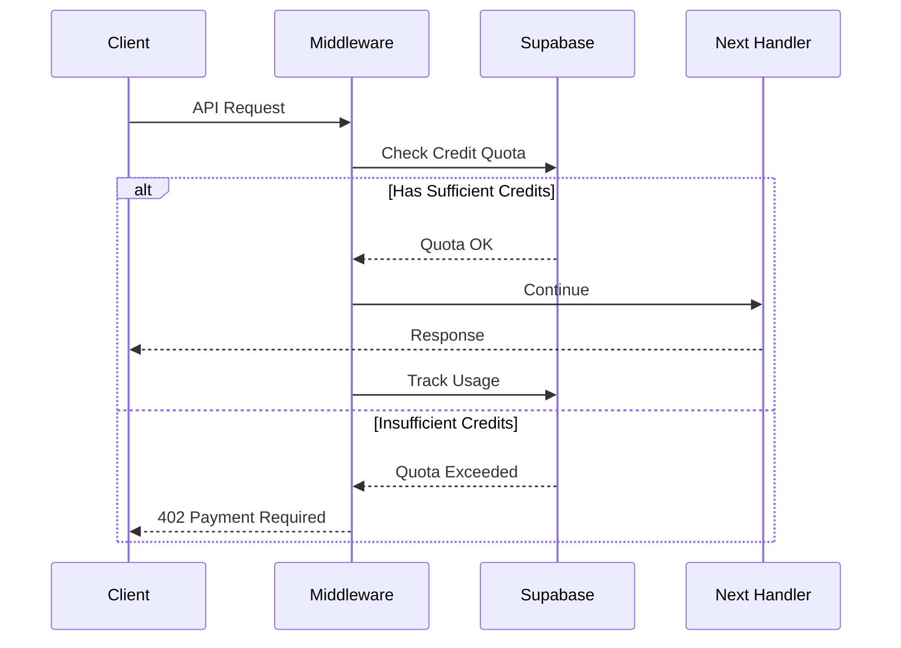

# Credit Middleware System

A robust Express middleware for managing API credits and usage tracking with Supabase integration.

## Overview

The credit middleware system provides:

- Pre-request credit quota validation
- Post-request usage tracking
- Variable operation size support
- Automatic error handling

## How It Works

### 1. Credit Validation Flow



### 2. Usage

```typescript
import { createCreditMiddleware } from "./middleware/credit-middleware";

// Basic usage
app.post(
  "/api/search",
  createCreditMiddleware({
    serviceId: "search-api",
    operationName: "search_keywords",
  }),
  searchHandler
);

// With variable operation size
app.post(
  "/api/batch-process",
  createCreditMiddleware({
    serviceId: "batch-api",
    operationName: "process_items",
    operationSize: 5, // Costs 5 credits per request
  }),
  batchHandler
);
```

### 3. Configuration

The middleware accepts the following configuration:

```typescript
interface CreditMiddlewareConfig {
  supabaseClient: SupabaseClient<Database>;
  serviceId: string; // Unique identifier for the API service
  operationName: string; // Name of the operation for tracking
  operationSize?: number; // Credit cost per operation (default: 1)
}
```

### 4. Response Codes

- `401 Unauthorized`: Missing user authentication
- `402 Payment Required`: Insufficient credits
- `500 Internal Server Error`: Unexpected errors

### 5. Usage Tracking

The middleware automatically tracks:

- Operation name
- Request status
- Request ID
- Credit cost
- Timestamp
- User ID
- Service ID

## Error Handling

The middleware includes comprehensive error handling:

1. Authentication errors (401)
2. Credit quota errors (402)
3. RPC errors (500)
4. Usage tracking errors (logged but non-blocking)

## Testing

The feature includes extensive tests covering:

- Authentication scenarios
- Quota management
- Variable operation sizes
- Error handling
- Response handling

## Dependencies

- Express.js: For middleware integration
- TypeScript: For type safety

## Best Practices

1. Always set appropriate operation sizes for resource-intensive operations
2. Monitor credit usage patterns through Supabase
3. Handle 402 responses gracefully in clients
4. Use meaningful operation names for better tracking

## Security

The middleware:

- Requires authenticated requests
- Uses UUID for request tracking
- Validates all inputs
- Handles errors securely
